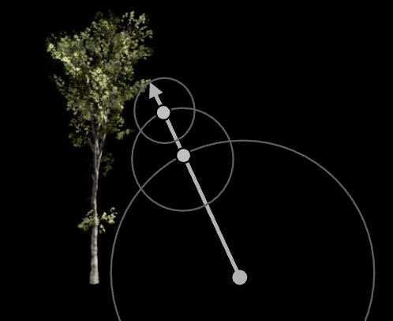

# Dynamic Occlusion with SDF

2015年SIGGRAPH，epic提出一种基于SDF的occlusion算法

## 问题

需要找到一种比较好的动态物体occlusion算法，应满足

- 软（soft）、准确（accurate）、不连续（incoherent）
- 能用于阴影、天空、反射球

现存的动态oc技术都有局限性

- shadowmap：连续
- SSAO：丢失边界和被撤档区域的信息
- Voxel cone tracing：耗费大，处于性能考虑没法使用过高精度
- 预计算的体积AO：自阴影分辨率低，难以避免被多个物体过度遮挡

## SDF

[SDF](https://iquilezles.org/articles/distfunctions/)

SDF（Signed Distance Field）有很多用处，比如体积建模，比如加速射线检测

```cpp
float sdf(float3 pos, args...){
  if(pos 在模型表面){
    return 0;
  }
  else if(pos 在模型外){
    return pos距离模型表面最近的距离;
  }
  else{
    return -pos距离模型表面最近的距离;
  }
}
```

SDF体积建模

```cpp
// 以原点为球心的球
float sdfSphere(float3 pos, float r){
  return length(pos) - r;
}
// 以原点为中心的长方形
float sdfBox(float3 pos, float3 box){
  float3 q = abs(pos) - box;
  return length(max(q, 0.0)) + min(max(q.x, max(q.y, q.z)), 0.0);
}
```

SDF射线检测




