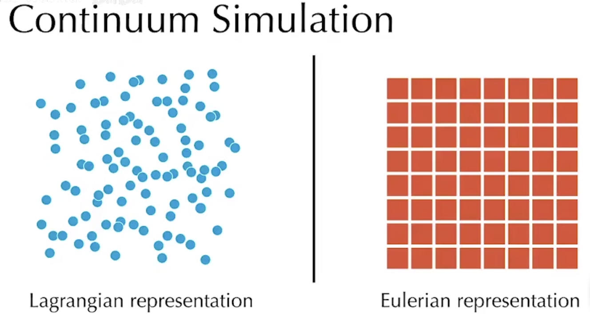
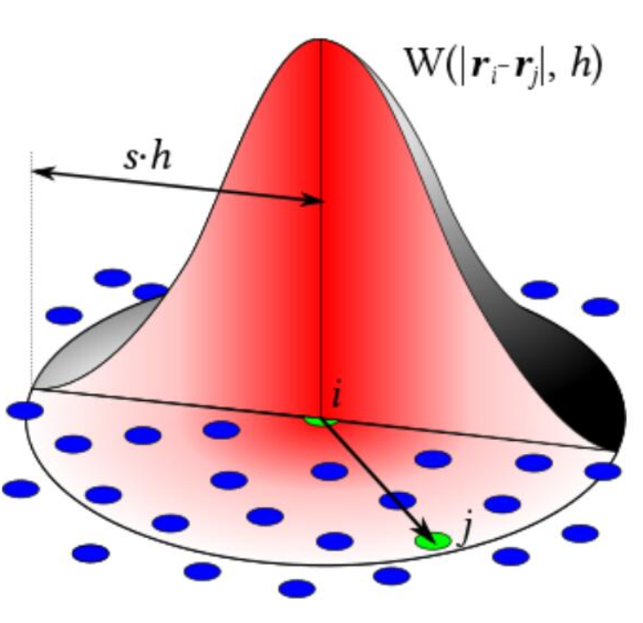
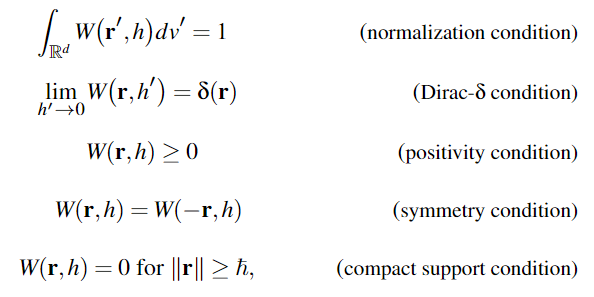
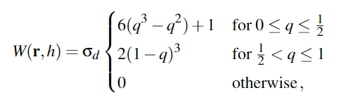

# SPH

SPH（Smoothed Particle Hydrodynamics）光滑粒子流体力学

> A mesh-free method for the discretization offunctions and partial differential operators

## 介绍

SPH是一种基于拉格朗日视角的算法，是一种空间离散化的算法，常用于连续介质的数值模拟

- 拉格朗日视角：视角随着介质移动而移动（粒子模拟）
- 欧拉视角：视角是固定的，检测穿过视角的介质流速（网格模拟）

### 狄拉克函数

狄拉克$\delta$函数，这是一个广义函数，其在整个定义域中积分值为1，但都集中在原点
$$
\delta (\mathbf{r})= \begin{cases}
\infty & |\mathbf{r}|=0 \\\\
0 & otherwise
\end{cases}
$$
该函数仅在积分中有意义，可以通过高斯钟形函数（正态分布）逼近

在物理学中我们常用质点表示物体，但是因此使得密度函数失去了意义（因为质点没有空间），此时密度函数就塌缩成了狄拉克函数

空间中任何标量场函数，都可以用狄拉克函数表示：
$$
A(\mathbf{x})=(A*\delta)(\mathbf{x})=\int A(\mathbf{x}')\delta (\mathbf{x}-\mathbf{x}')dv'
$$

- $dv'$是$\mathbf{x}'$对应的体积积分变量
- $A(\mathbf{x}): \mathbb{R}^d \rightarrow \mathbb{R}$，d是维度

> $\mathbb{R}$是实数集
>
> $\mathbb{R}^+$是正实数集（不含0）
>
> $\mathbb{R}^d$是d维实数集

### 光滑核函数

我们有了狄拉克函数，想要把连续函数来离散表示

核函数（kernel functions，smoothing kernels）是一种随着距离而衰减的函数，与高斯函数要在整个作用域积分不同，核函数是有最大影响半径的，最大影响半径用$h$表示

核函数满足

1. 归一化
2. 狄拉克条件
3. 非负性
4. 对称性
5. 有界性

一个经典的核函数是三次样条器（cubic spline kernel）

- 其中$q=\frac{1}{h}||\mathbf{r}||$

### 离散化

### Mass Density Estimation

###  Discretization of Differential Operators

## 符号表

## 参考

[Physics Simulation in Visual Computing](https://interactivecomputergraphics.github.io/physics-simulation/)

[GAMES201](https://www.bilibili.com/video/BV1ZK411H7Hc)

[MrKill的知乎](https://zhuanlan.zhihu.com/p/426566636)
