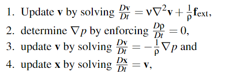

# SPH入门

SPH（Smoothed Particle Hydrodynamics）光滑粒子流体力学

> A mesh-free method for the discretization of functions and partial differential operators

SPH是一种基于拉格朗日视角的算法，是一种空间离散化的算法，常用于连续介质的数值模拟

- 材质导数的坐标

  - 拉格朗日坐标：视角随着介质移动而移动（粒子模拟）

  - 欧拉坐标：视角是固定的，检测穿过视角的介质流速（网格模拟）

## 狄拉克函数

狄拉克$\delta$函数，这是一个广义函数，其在整个定义域中积分值都集中在原点
$$
\delta (\mathbf{r})= \begin{cases}
\infty & |\mathbf{r}|=0 \\\\
0 & otherwise
\end{cases}
$$
该函数仅在积分中有意义，可以通过高斯钟形函数（正态分布）逼近

在物理学中我们常用质点表示物体，但是因此使得密度函数失去了意义（因为质点没有空间），此时密度函数就塌缩成了狄拉克函数

空间中任何标量场函数，都可以用狄拉克函数表示：
$$
A(\mathbf{x})=(A*\delta)(\mathbf{x})=\int A(\mathbf{x}')\delta (\mathbf{x}-\mathbf{x}')dv'
$$

- $dv'$是$\mathbf{x}'$对应的体积积分变量
- $A(\mathbf{x}): \mathbb{R}^d \rightarrow \mathbb{R}$，d是维度，意思就是这是一个空间函数

> $\mathbb{R}$是实数集
>
> $\mathbb{R}^+$是正实数集（不含0）
>
> $\mathbb{R}^d$是d维实数集

## 光滑核函数

我们有了狄拉克函数，想要把连续函数来离散表示

核函数（kernel functions，smoothing kernels）是一种随着距离而衰减的函数，与高斯函数要在整个作用域积分不同，核函数是有最大影响半径的，最大影响半径用$h$表示

核函数满足

1. 归一化
2. 狄拉克条件
3. 非负性
4. 对称性
5. 有界性

一个经典的核函数是三次样条器（cubic spline kernel）

- 其中$q=\frac{1}{h}||\mathbf{r}||$

## 离散化

> 有个数学大佬告诉我，这里就是“在某个i点处求所有其他j点按核函数加权的平均值，只不过离散化的时候划成了区块赋予了密度和体积”
>
> 换句话说，这其实就是一次卷积（数学家真是不讲人话）

参考上面那张核函数的图，离散化就是对于$i$点，我们求该点附近场密度函数值和核函数（一堆$j$点）的加权平均值

在数学上，$\langle A(x)\rangle $表示平均值

## 质量密度估计

粒子不需要携带质量密度函数，对于空间中任意位置的点，都可以通过离散化求出该点密度

对于$\mathbf{x}_i$位置处的点，其密度为：

$$
\rho_{i} =\sum_{j} m_{j}W_{ij}
$$
不过在流体边界，这样求密度会导致数据偏小，需要做边界处理

下图绿色点临域完整，得到正确的密度，而红色点只能得到一个较小的密度

##  微分算子的离散化

上面我们已经实现场函数的离散化，实现了质量密度估计。但除此之外，还有一些空间微分算子（导数）值得离散化
$$
\nabla A_{i}\approx \sum_{j} A_{j}\frac{m_{j}}{\rho_{j} } \nabla W_{ij}
$$

> 关于拉普拉斯算符，可以去看[Nabla算子](/2023/01/31/math/Nabla%E7%AE%97%E5%AD%90/)，简单来说这东西是将标量场转化为向量场，一阶算符就是梯度，二阶是散度，用于得到数据变化最快的方向。文中也实现了拉普拉斯算符的离散化

文章介绍了两种最常用的梯度的近似方法，并给了适用范围

- 差分公式（Difference Formula）：用于近似速度的散度
- 对称公式（Symmetric Formula）：用于近似力、脉冲的梯度

### 差分公式

在高中学微积分时，我们用两个相邻的点组成的线来逼近切线，以此引入了极限、导数的概念。在实际应用中，这两个点不可能无穷近，于是存在误差

使用差分表示导数（导数就是），我们只能把$h$取到一个很小的值，而不是无穷小，因此这个导数是有误差的
$$
f'(x)=\lim_{h \rightarrow0}\frac{f(x+h/2)-f(x-h/2)}{h}
$$
我们需要衡量这个误差的大小，于是我们将$f(x\pm h/2)$泰勒展开后带入上式，得到
$$
f'(x)=\lim_{h \rightarrow0}\frac{f'(x)h+O(h^3)}{h}=f'(x)+O(h^2)
$$
误差大小为$O(h^2)$

> 经计算，二阶导数的误差也是$O(h^2)$

## 控制方程

尽管物体在微观层面（比如原子）是离散的，但在宏观层面上，流体、固体表现为连续介质

> continuum, a region of continuously distributed mass

根据定义，一个连续介质可以被切分为多个小的连续介质（类比实数的稠密性，任意两个实数间总存在第三个实数），而不影响其性质

材料粒子（material particle）：a portion of matter contained in an infinitesimal volume

### 连续性方程

连续性方程描述了物体的密度与时间的关系
$$
\frac{D\rho}{Dt}=-\rho(\nabla \cdot \mathbf{v})
$$

### 随体导数

随体导数（material derivative）：$\frac{D(\cdot)}{Dt}$

随体导数描述了材质点的场量随着时间的变化率

在制作不可压缩的介质中，必须始终保持
$$
\frac{D\rho}{Dt}=0
$$
随体导数与坐标系有关，常见的坐标系有：拉格朗日坐标系和欧拉坐标系

### 线性动量守恒定律

高中物理就学过的碰撞时动量守恒，力作用在物体上，会改变物体的动量

将运动公式（equation of motion）用积分的形式写出来就是
$$
\rho \frac{D^2\mathbf{x}}{Dt^2}=\nabla \cdot \mathbf{T}+\mathbf{f}_{ext}
$$

- $\mathbf{T}$：应力张量（stress tensor）
- $\mathbf{f}_{ext}$：体积力（body forces），穿越空间作用在所有流体元上的非接触力，例如重力、惯性力、电磁力

#### 理解应力张量

对于材质内部一个微小平面，这个平面会受材质中其他点的作用力，这个力可能不与平面垂直。其中垂直于平面的力叫正向应力，平行于平面的力叫剪应力

矢量是一种一维张量，由大小和一个方向组成。然而对于应力，我们没法使用矢量进行表示，于是改用二维张量来表示，一个方向是应力的指向，一个方向是应力所在的平面方向

对于材质内一个点，它可能处于无数个平面中，我们需要用一种平面无关的方式来表示其受力状态。在三维空间中，我们选择了三组正交基底$(\mathbf{e}_1,\mathbf{e}_2,\mathbf{e}_3)$构建坐标系，应用中给定一个方向$\mathbf{e}$，就能求出该方向的应力矢量

其中$\mathbf{T}$为应力矢量，$\sigma $为柯西应力张量（一个3x3的矩阵）

$\sigma_{xy}$的意思是，处于yz平面，指向y方向

> 柯西应力张量只适用于材料微小变形的情况

#### Navier-Stokes方程

一个经典的不可压缩流体的张力表示方法
$$
\mathbf{T}=-p+\mu (\nabla \mathbf{v}+\nabla  \mathbf{v}^T)
$$

- $p$：压强
- $\mu$：粘度（viscosity ）

我们将该液体的应力张量公式带入牛顿运动公式，得到速度的公式
$$
\rho \frac{D\mathbf{v}}{Dt}=-\nabla p + \mu \nabla^2 \mathbf{v}+\mathbf{f}_{ext}
$$
压强可以由密度表示，根据理想气体压强公式，我们得知压强与密度呈线性关系，于是我们取一个静止状态下的密度$\rho_0$，通过与当前状态密度做差值，就能得出压强

> 理想气体压强公式，初中就学了，$pV=nRT$

$$
p=B((\frac{\rho}{\rho_0})^{\gamma}-1)
$$

- $B$：体积模量（bulk modulus）

#### 弹力

拥有弹力的固体，应力张量来自于固体的形变，之后会展开讲

## 混合初始边界值问题

我们上面给出了控制方程，但是想要求解运动问题，必须给定初始位置和速度（场）

一般而言，混合初始边界值问题（Mixed Initial-Boundary Value Problem）没有解析解，只有数值解

> 得嘞，这一节就这一句话，这一句话一个字都看不懂

### 混合边界

> 简单来说，就是要想求解运动问题，必须既要给初始位置，也要给初始速度（场）

边界条件也叫定解条件，是微分方程里的概念，给定初始值才能求控制方程、偏微分方程的解（比如带入解中的未知数）

放在物理学中叫临界条件，就是物体处于某两种状态间的交界处，比如冰水混合物

边界条件对于解决物理问题（比如求极值）十分重要

有三类边界条件

- 第一类边界条件（迪利克雷边界条件，Dirichlet boundary condition）
  - 直接告诉你边界值，比如热传递中告诉你边界处温度
- 第二类边界（若依曼边界条件，Neumann boundary condition）
  - 告诉你边界处的梯度，比如热传递中告诉你热流密度（温度的梯度）
- 混合边界条件
  - 第一二类边界的混合，比如热对流微分公式，公式中既有温度，也有梯度，只有同时给出两者，才能求解

$$
q=h(T_0-T_a)
$$

### 解析解与数值解

- 解析解（analytic solution），形如一个函数，给定变量就能得出任意位置的解
- 数值解（numerical solution），这是一个数，是采用有限元、数值逼近、插值等方法得到的解

> 据说在数学家和物理学家眼里，解析解才是真正的解，更高贵，美丽
>
> 让我突然想到三体力魏成想要求出三体问题的解析解，结果最后发现这个问题只有数值解

## 算子分裂

就是使用分治的算法，将一个复杂的偏微分方程（PDE），分解为几个连续的子问题

在实践中证明，像这样每步操作依赖于上一步，一步一步操作，能提高系统的稳定性

## 时间积分

在实时渲染中，和精度相比，性能、稳定性和鲁棒性更重要

在GAMES201开篇讲弹簧质点模型时，关于质点的运动方程，给出了两种积分器：显式积分器和隐式积分器

### 显式积分器

从过去的状态得到现在的状态，表示简单容易实现
$$
\mathbf{v}_{t+1}=\mathbf{v}_t+\Delta t \frac{\mathbf{f}_t}{m}
$$

$$
\mathbf{x}_{t+1}=\mathbf{x}_t+\Delta t \mathbf{v}_{t+1}
$$

但是显式积分器有一个问题，就是容易爆炸，于是$\Delta t$不能太大，应满足
$$
\Delta t \le c\sqrt{\frac{m}{k}} \ \ (c \sim 1)
$$

#### CFL条件

这是CFL条件（Courant–Friedrichs–Lewy condition），是某些偏微分方程的收敛条件，它决定了显式积分器中粒子在单位时间内走过的距离，必须小于粒子大小（或者说质点间的间距）
$$
\Delta t \le \lambda \frac{\tilde{h}}{\|\mathbf{v}^{\max}\|}
$$

- $\tilde{h}$：粒子大小（质点间的间距）
- $\lambda$：一个常量
- $\mathbf{v}^{\max}$：粒子运动的最快速度

### 隐式积分器

现在的状态依赖于现在的状态（求$t+1$时刻的信息，结果需要$t+1$时刻的信息），难以实现，但鲁棒性强
$$
\mathbf{v}_{t+1}=\mathbf{v}_t+\Delta t \mathbf{M}^{-1}\mathbf{f}(\mathbf{x}_{t+1})
$$

$$
\mathbf{x}_{t+1}=\mathbf{x}_t+\Delta t \mathbf{v}_{t+1}
$$

- $\mathbf{M}$：质量矩阵

## 案例

## 符号表

### 参考

[Physics Simulation in Visual Computing](https://interactivecomputergraphics.github.io/physics-simulation/)

[GAMES201](https://www.bilibili.com/video/BV1ZK411H7Hc)

[MrKill的知乎](https://zhuanlan.zhihu.com/p/426566636)
