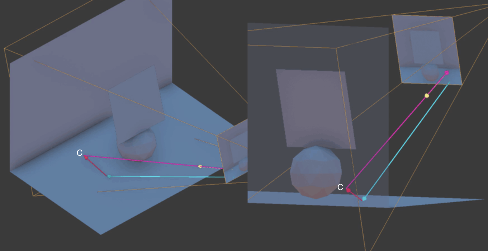
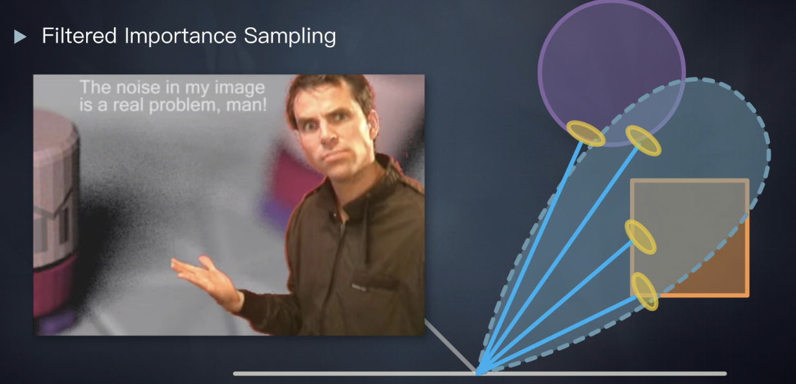
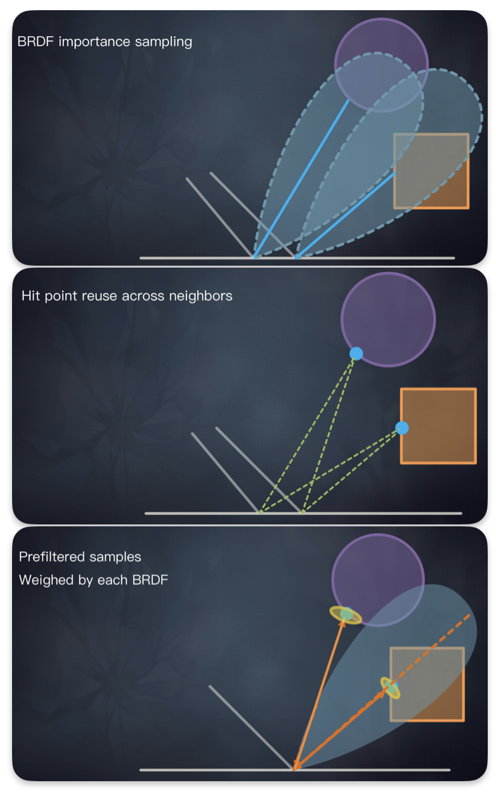

# Stochastic Screen Space Reflections

2015年SIGRAPH，EA提出了SSSR，用于《镜之边缘》中镜面反射

需求有

- 支持清晰（sharp）和模糊（blurry）反射
- 越近反射越清晰（contact hardening）
- 高光拉伸
- 逐像素的粗糙度和法线

## 相关工作

### mirror-only SSR

我们先回顾传统的SSR

1. 从屏幕像素开始RayMarching（需要View空间的世界坐标和法线）
2. 根据深度可以很轻松找到第一个落点，根据法线很容易求出反射光线的角度
3. 使用简单的线性步进，求反射光线的命中点
   1. 反射光线向前步进一段距离，到达C点
   2. 通过三角形边角性质，可以求出C点距离镜头的距离，这其实就是View空间的深度
   3. 若C点距离镜头的距离等于深度，则说明命中
4. 将命中位置进行透视投影，使用上一帧的渲染结果作为反射颜色

### glossy SSR

#### 模糊滤波

杀戮尖塔提供了一种glossy SSR，就是对反射像素做一次卷积模糊，但这种模糊是一视同仁的模糊，没有实现越近越清晰

#### 重要性采样

相对于普通的SSR，这里根据法线求反射光线方向时，加入一些随机偏差，反射光线形成了一个锥形，进而实现了模糊的SSR

当物体离反射面比较近时，根据正弦定理，滤波的像素数量更少，于是清晰度更高

但是在光线数量比较少的情况下，会有大量噪点，效果很差

## 作者的算法

作者的方法=模糊滤波+重要性采样

1. 将屏幕划分为Tile，进行一次低分辨率的光线步进，评估Tile的重要性，需要多少射线
2. 根据材质粗糙度判断使用何种的RayMarching
   - 昂贵的射线：借助Hi-Z的精确tracing，能得到准确的命中点
     - 用于smooth表面
   - 便宜的射线：简单的线性步进
     - 用于粗糙表面（反正会做严重的滤波，不需要高精度）
3. 使用BRDF重要性采样决定射线方向
4. 使用邻居的采样信息进行模糊

### Tile评估

1. 对于每一个Tile以1/8分辨率发射射线
2. 判断射线（的反射光线）是否击中
   1. 若所有光线都没命中，则跳过这个Tile的步进
   2. 根据命中的比例和命中信息的差异，判断这个Tile中的像素需要多少个光线

### Hi-Z tracing

> 详情可以去看《GPU Pro 5》

Hi-Z使用四叉树组织屏幕深度，将层次关系存储在MipMap层级中

### 重要性采样

### 复用邻居光线

## 参考

[SSR](https://lettier.github.io/3d-game-shaders-for-beginners/screen-space-reflection.html)

