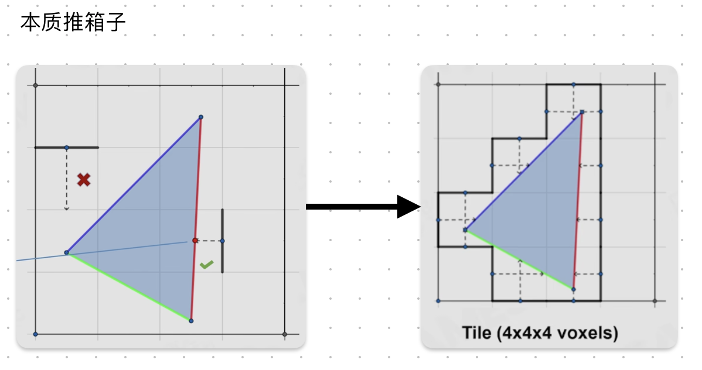

# Probe-based Lighting in Unity Enemies

2022年SIGGRAPH，Unity发布了一个数字人项目，在头发、眼球、GI方面效果非常好，我们来分析一下他的Probe-based GI

[论文地址](http://advances.realtimerendering.com/s2022/SIGGRAPH2022-Advances-Enemies-Ciardi%20et%20al.pdf)

> 感觉原理上就是在Volume GI的基础上，存了遮罩信息用于偏移采样点，使用紧凑哈希提高了空间利用率，感觉手游大世界完全可以上这个


### 不用Lightmap

- 难以处理复杂的集合体，难以处理LOD
- 烘焙速度慢，严重制约开发效率
- 无法处理动态物体，无法提供统一的光照
- 无法处理人物
- Worse directional quality

### Adaptive Probe Volumes

将空间划分为相同大小的cell，将cell作为分块烘焙、分块加载的最小单位

cell被细分为brick，在几何体密集的地方，brick越细分


#### 细分

> 可以参考Lumen中Build Voxel Faces，本质就是推箱子

细分的原理是使用Raycast判断一个区域有没有物体（命中点），我们使用SDF加速射线检测



1. 我们将一个cell划分为4x4的brick，这样就有16条起始边界，这些边界构成了一个正方形
2. 每一条边界向内发射一条长度为一的射线（使用SDF加速），若没有命中，则向内移动一格
3. 直到所有边界都命中后，我们得到右图所示的brick

#### 数据结构

感觉很类似与VolumeGI，由索引buffer和3DTexture组成，通过紧凑哈希来降低存储

- An indirection buffer存储了cell信息，cell索引→SH指针
- Spherical Harmonics Pool中存储SH信息，SH指针→SH系数


#### 采样

采样流程：World Position → Cell Indirection → Per-Cell Brick Indirection→ Brick UVW →Trilinear Sample SH Data

1. 基于着色点posWS生成cellPos
2. 加载cell信息
3. 找到该着色点位于cell中哪一个brick（brick的最低层级可能是由相机距着色点距离决定的）

```cpp
int localBrickIndex = floor(residualPosWS / (_MinBrickSize * pow(3, minFoundBrickLevel)));	//若minFoundBrickLevel=1，那么cell被细分为3x3个brick
localBrickIndex -= validArea.min;
```

4. 加载brick信息

5. 通过brick信息+offset采样3DTexture


### 接缝

我们根据场景几何体密度构建空间八叉树，对于稀疏空间使用精度更低的高Subdiv Level存储Probe信息，在Level交界处有时会有明显的接缝问题

解决方法：采样时加入抖动

### 黑斑

当我们做Probe摆放时，由于按网格和brick摆放，经常会出现Probe放在墙内的情况，这会导致墙面、地板发黑

Unity的做法是一种辐照度驱动的摆放，通过判断Probe位置处四周backface比例，来判断这个Probe的有效性


对于有效性低/无效的Probe，Unity给出了两种解决方法

- 让墙内Probe变亮（Post-Bake）
- 让墙内Probe向外偏移（Pre-Bake）

#### Post-Bake

1. 烘焙后遍历Probe，找到在墙内的无效Probe
2. 搜索其邻居Probe，使用其中**有效**Probe进行加权插值，权重是距离的平方反比


#### Pre-Bake

> 参考《The lighting technology of Detroit Become Human》

使用Post-Bake后，确实黑斑少了，但是我们发现墙体出现了漏光


### 漏光

> 我感觉防漏光的本质就是让墙体“变厚”，无论是摆放层面上的遮光板，还是是采样层面的偏移

传统的Probe着色，薄墙体由于使用了墙壁另一面的Probe信息，于是发生漏光。为了避免漏光，采样时通常对采样位置进行偏移（Biases）

- Normal Bias，采样点沿着法线方向偏移
  - 这样做实际上让物体沿着法线方向变大了
  - 偏移的过多/过少，都会影响效果
- View Bias，采样点朝着相机方向偏移
  - 依赖于相机

而Unity使用了Validity Based Weighting技术来减弱漏光，号称能完全避免对无效Probe的采样

原理上是通过标记遮罩得出偏移方向，本质还是对采样点进行偏移

- 每一个Probe存储者8bit的遮罩，用于记录其八个方向（2x2x2）的邻居是否有效（这个有效性是Post-Bake时记录的？）
- 若某个邻居无效，则推动采样点远离那个邻居（计算偏移的方向和大小）

### 场景管理

将球偕信息编码在3DTexture中比较好做Streaming


