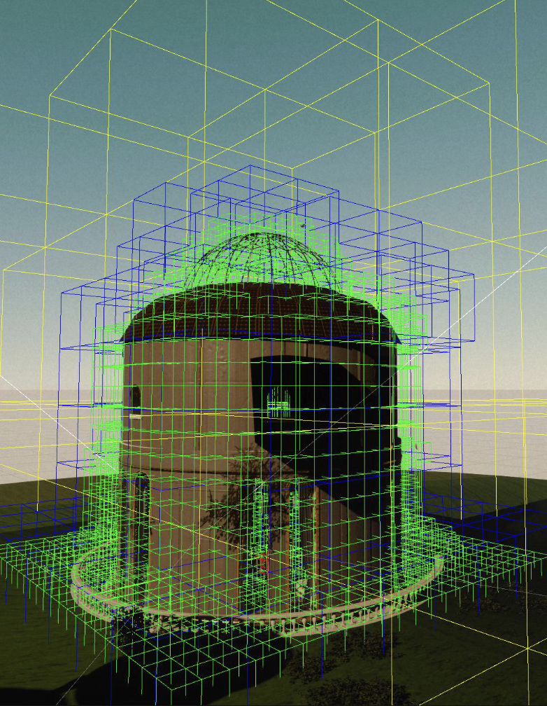
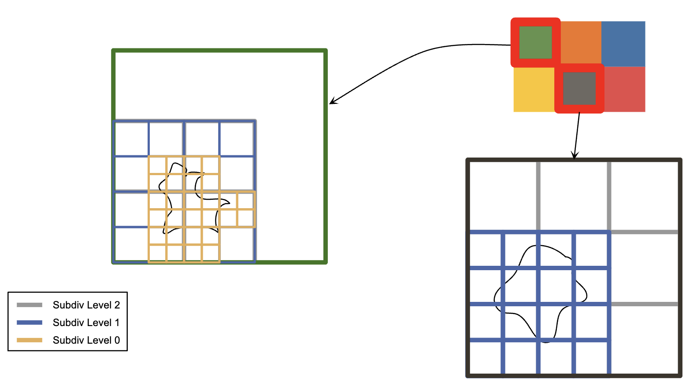
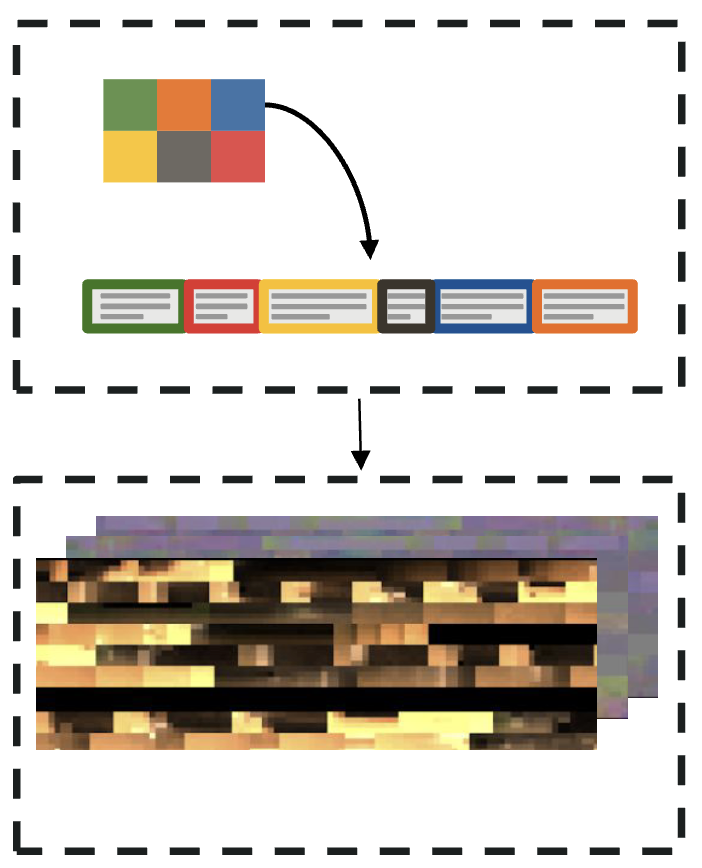
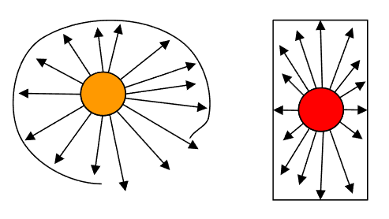
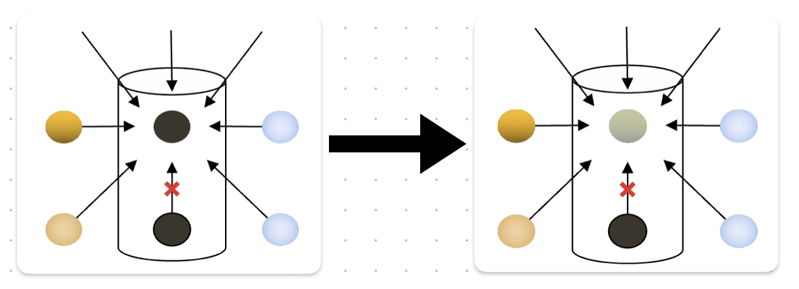
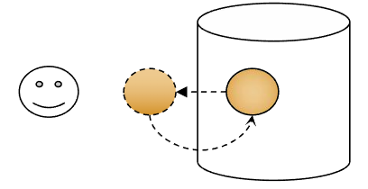
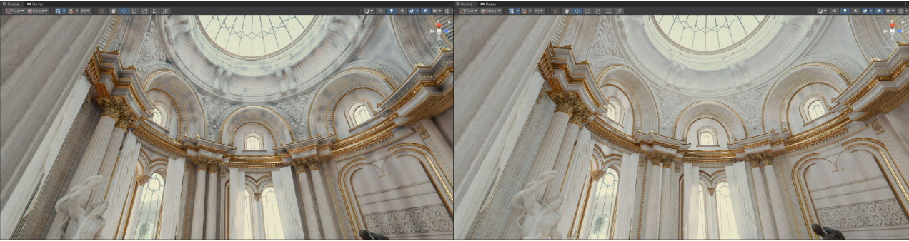

# Probe-based Lighting in Unity Enemies

2022年SIGGRAPH，Unity发布了一个数字人项目，在头发、眼球、GI方面效果非常好，我们来分析一下他的Probe-based GI

[论文地址](http://advances.realtimerendering.com/s2022/SIGGRAPH2022-Advances-Enemies-Ciardi%20et%20al.pdf)

> 锐评：就这？本质就是一个Volume GI，存了遮罩信息用于偏移采样点，使用紧凑哈希提高了空间利用率，感觉手游大世界完全可以上这个

### 不用Lightmap

- 难以处理复杂的集合体，难以处理LOD
- 烘焙速度慢，严重制约开发效率
- 无法处理人物（和动态物体）
- Worse directional quality

### Adaptive Probe Volumes

距离几何体越近，摆放越密集

### 数据结构

感觉很类似与VolumeGI，由索引buffer和3DTexture组成，通过紧凑哈希来降低存储

- An indirection buffer存储了cell信息，cell索引→SH指针
- Spherical Harmonics Pool中存储SH信息，SH指针→SH系数

采样流程：World Position → Cell Indirection → Per-Cell Brick Indirection→ Brick UVW →Trilinear Sample SH Data

### 接缝

我们根据场景几何体密度构建空间八叉树，对于稀疏空间使用精度更低的高Subdiv Level存储Probe信息，在Level交界处有时会有明显的接缝问题

解决方法：采样时加入抖动

### 黑斑

当我们做Probe摆放时，经常会出现Probe放在墙内的情况，这会导致墙面、地板发黑

Unity的做法是一种辐照度驱动的摆放，由两部分组成

- Post-Bake：对于某个Probe，查找其相邻Probe信息，若发现有在墙内的Probe，就将其删去
- Pre-Bake：若发现Probe在墙内，则将Probe根据法线向外偏移至墙外

> 这部分Unity没有讲清楚，但大致内容就是从Probe处出发向四周发射射线（也可能是其他查找方式），根据射线命中的百分比，确定这个位置的有效性。若有效性为0，则说明Probe位于墙体内部，就将其删去或向外推走

评分：

删除：

推走：

效果：

### 漏光

> 我感觉防漏光的本质就是让墙体“变厚”，无论是摆放层面上的遮光板，还是是采样层面的偏移

传统的Probe着色，薄墙体由于使用了墙壁另一面的Probe信息，于是发生漏光。为了避免漏光，采样时通常对采样位置进行偏移（Biases）

- Normal Bias，采样点沿着法线方向偏移
  - 这样做实际上让物体沿着法线方向变大了
  - 偏移的过多/过少，都会影响效果
- View Bias，采样点朝着相机方向偏移
  - 依赖于相机

而Unity使用了Validity Based Weighting技术来减弱漏光，号称能完全避免对无效Probe的采样

原理上是通过标记遮罩得出偏移方向，本质还是对采样点进行偏移

- 每一个Probe存储者8bit的遮罩，用于记录其八个方向（2x2x2）的邻居是否有效（这个有效性是Post-Bake时记录的？）
- 若某个邻居无效，则推动采样点远离那个邻居（计算偏移的方向和大小）

### 场景管理

将球偕信息编码在3DTexture中比较好做Streaming

