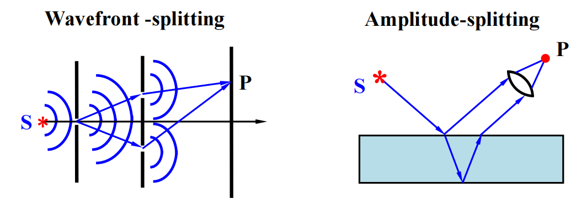
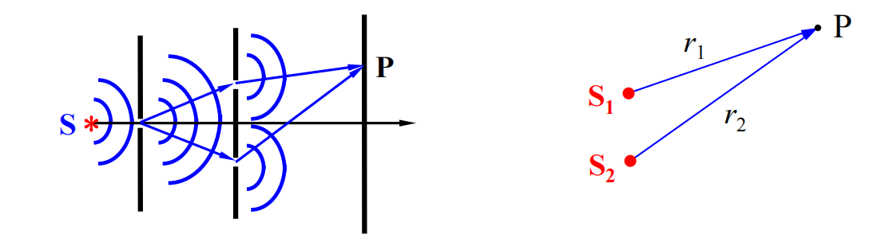
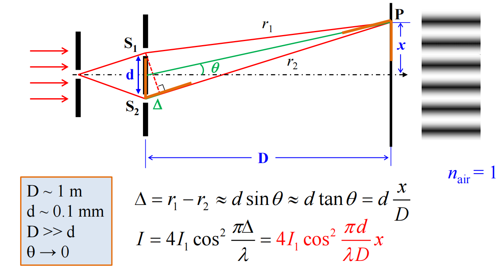
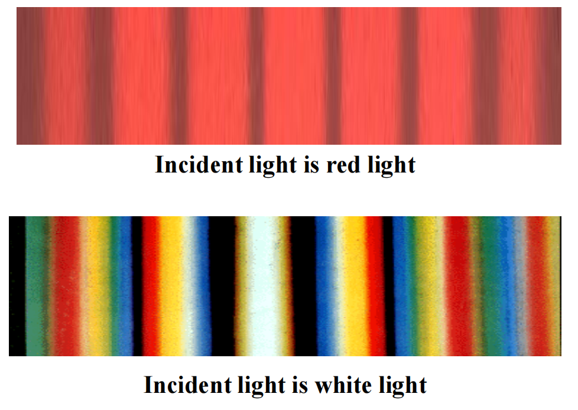
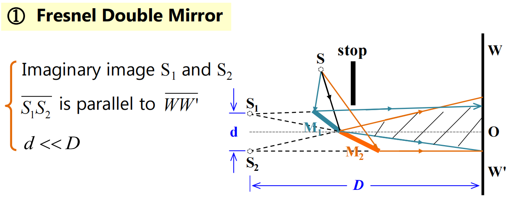
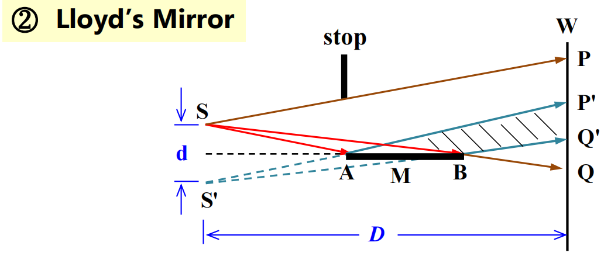
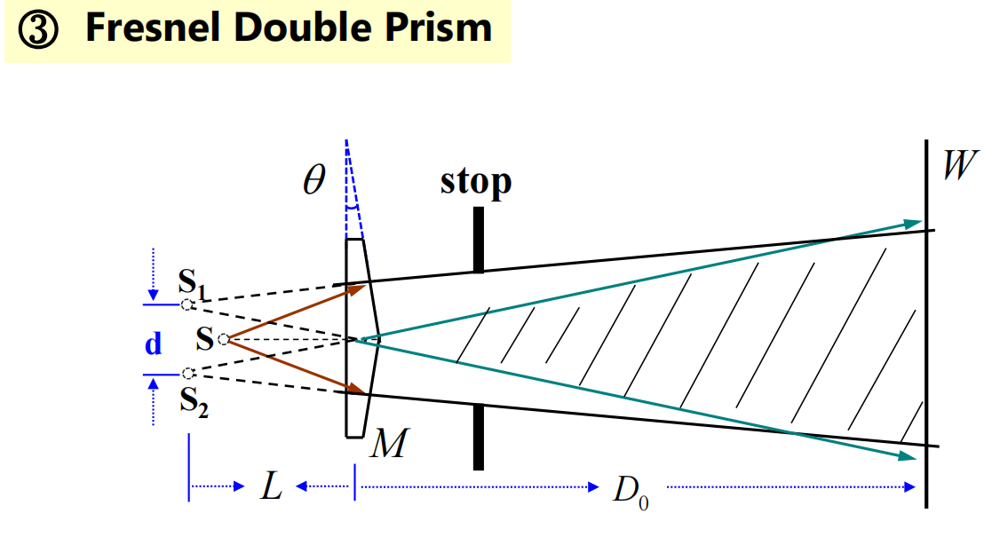
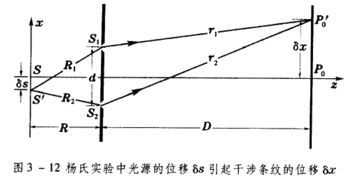
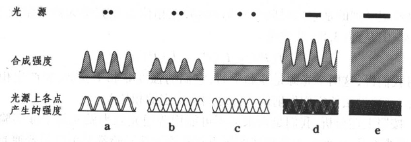
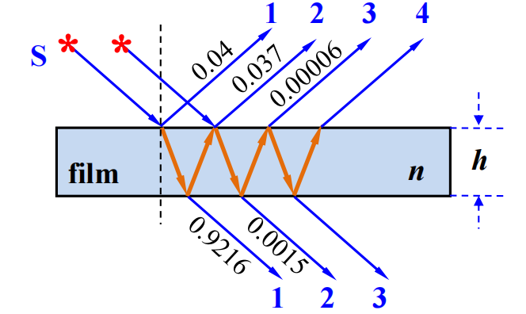

# 六：干涉

## 内容概述

- 干涉（Interference），光的叠加不满足线性叠加，证明了光的波性
- 干涉条件
- 干涉方法与装置
- 干涉仪

## 干涉

干涉让光学从线性光学变成非线性光学

### 线性光学

在几何光学中，我们认为光是独立传播的

光是一种横波，光在介质中传播会引起介质粒子振动，若独立传播成立，那么两束光的交叉区域，粒子的振动是两个振动的叠加，这就是**叠加原理**

光的叠加实际上是介质的性质（因为描述的是介质粒子振动的叠加）

- 线性介质：在该介质中，波满足叠加原理
- 非线性介质：在该介质中，波不满足叠加原理

违反叠加原理的介质是非线性介质，现象是非线性现象，学科是非线性光学

此外，叠加原理只有在低强度光下才成立，因此激光发明后，非线性光学才蓬勃发展

### 复振幅叠加法

求解相干光强有三种方法，实际分析时通常使用复振幅法

- 三角函数法：波可以由三角函数表示，对三角函数做恒等变化，即可求相干光强
- 矢量图解法
- 复振幅法

首先将三角函数表示为复振幅
$$
\tilde{\mathbf{E}_i}=\mathbf{A}_i e^{i\varphi _i}
$$
复振幅的叠加
$$
\tilde{\mathbf{E}}=\sum_{i=1}^n\tilde{\mathbf{E}_i}
$$
合光强
$$
I = \tilde{\mathbf{E}}\cdot \tilde{\mathbf{E}}^*
$$

### 相干叠加

现在有两个相同频率（frequency）相同偏振（polarization）的光波，下面是他们电场强度随时间的变化（用复数表示三角函数）
$$
\mathbf{E_1}=\mathbf{A_1} e^{i(kr_1-\omega t+\varphi _{01})}
$$

$$
\mathbf{E_2}=\mathbf{A_2} e^{i(kr_2-\omega t+\varphi _{02})}
$$

他们相交于点P，根据叠加原理，P点点电场强度为
$$
\mathbf{E}=\mathbf{E_1}+\mathbf{E_2}=[\mathbf{A_1}e^{i(kr_1+\varphi_{01})} + \mathbf{A_2}e^{i(kr_2+\varphi_{02})}]e^{-i\omega t}
$$
显然，振幅为
$$
\tilde{\mathbf{E}}=\mathbf{A_1}e^{i(kr_1+\varphi_{01})} + \mathbf{A_2}e^{i(kr_2+\varphi_{02})}
$$
由于光过于高频，我们没法实时进行光电场强度的检测，于是我们使用光强（intensity，$I$）来进行推导

$$
I \propto \tilde{\mathbf{E}}\cdot \tilde{\mathbf{E}}^*=\mathbf{A_1}^2+\mathbf{A_2}^2+2\mathbf{A_1A_2}\cos(kr_1-kr_2+\varphi_{01}-\varphi_{02})
$$

$$
I = I_1+ I_2 + 2\sqrt{I_1I_2}\cos \delta
$$

$$
\delta=kr_1-kr_2+\varphi_{01}-\varphi_{02}
$$

我们发现，两个光波进行叠加，光强不只是简单叠加，还有一个尾巴，这个尾巴就是**干涉**

干涉：因波的叠加引起强度重新分布的现象

并且我们发现：

- 干涉强度与时间无关，与空间位置有关，且保持不变

- 当$\delta=2m\pi$，干涉强度最大，我们称之为构造干涉（constructive interference）

$$
I=(\mathbf{A_1}+\mathbf{A_2})^2
$$

- 当$\delta=(2m+1)\pi$，干涉强度最小，我们称之为相消干涉（destructive interference）

$$
I=(\mathbf{A_1}-\mathbf{A_2})^2
$$

### 非相干叠加

一般而言，两个光频率和偏振不一样，经过推导
$$
I_{12}=2\mathbf{A_1}\cdot \mathbf{A_2} \cos [(\omega_2 - \omega_1)t + \theta_1 - \theta_2]
$$
我们到处干涉强度为0的条件

- 两个光频率不同，$\cos[..]$的均值为0
- 两个光光矢量垂直，$\mathbf{A_1}\cdot \mathbf{A_2}=0$
- 两个光夹角（相位差）迅速且无序变化，$\cos[..]$的均值为0

### 干涉条件

因此我们总结出发生干涉的条件

- 频率相同
- 相同的平行分量
- 固定的相位差

如果不满足干涉条件，那么平均下来
$$
I=I_1+I_2
$$

## 获得干涉光

普通光源：普通光源的发光单位为原子、分子，不同原子间的发光是独立的，他们的频率、偏振、相位都是不同的，因此他们的光是不会发生干涉的

使用杨氏干涉实验、菲涅尔双棱镜、劳埃德镜可以将普通光源变成干涉光

### 杨氏双缝干涉实验

杨氏实验是通过两个点波光源进行干涉实验的典型

如果光是一种波，那么光在传播过程中应该会有波前（传播最靠前的波阵面），提取一个波前，并将其分为两部分，就能得到两个相干光

现在有一个非常窄的单色光源，经过两个带缝平面，会生成两个相干光，进而发生衍射现象，在平面留下明暗条纹

$$
I=4I_1\cos^2\frac{\pi \Delta}{\lambda}
$$

- 若$\Delta=m\lambda, I=I_{max}=4I_1$，呈现亮条纹
- 若$\Delta=(2m-1)\lambda/2, I=I_{min}=0$，呈现暗条纹

当间距不大时，角度比较小，缝间距是相同的，间距为
$$
\Delta x=\frac{D}{d}\lambda
$$
如果传入的是白光，条纹将为彩色

### 其他干涉仪器

本质都是杨氏双缝干涉，条纹间距都满足
$$
\Delta x=\frac{D}{d}\lambda
$$

#### 菲涅尔双平面镜

#### 劳埃德镜

#### 菲涅尔双棱镜

### 干涉条纹的移动

我们不仅观测到明暗条纹，还观测到条纹的移动和变化

- 移动光源，对于屏幕上一点，求多少个条纹经过该点
  - 对于屏幕上点P，经过点P的条纹数取决于两条相干光线的光程差（OPL）
  - 当光程差增减一个$\lambda$时，就会经过一条条纹

- 移动光源，对于特定的一个条纹，求其移动了多长距离
  - 杨氏双缝中

$$
\delta x = -\frac{D}{R}\delta s
$$

## 时空相干性

现实中的普通光源的发光单元为原子、分子，靠自发辐射发光（激光光源靠受激辐射），这是一个随机过程，产生的光是随机、无规律、不相干的。看起来我们无法用普通光源做干涉实验，但实际上杨氏双缝是可以使用普通光源的，因为杨氏双缝中两个光都是由同一束光分割而成的

尽管普通光源的相位随机，但是杨氏双缝两束光的相位差与原光源相位无关，仅与空间位置有关

不过，光源的尺寸和光谱尺寸仍然会对杨氏干涉产生影响

在杨氏干涉中，我们使用了很窄的单色光源，然而现实中光源总是有尺寸，其颜色也不是单色而是光谱中一小段

空间相干性：光源尺寸对干涉强度的影响

时间相干性：光谱尺寸对干涉强度的影响（也就是说光不是真的纯色）

### 空间相干性

干涉条纹的衬比度（constrast）定义为
$$
\gamma = \frac{I_\max-I_\min}{I_\max + I_\min}
$$
任何光源都有一定的宽度，我们将其视为多个不相干的点光源排布，屏幕上的总强度为各个光源的干涉条纹的线性叠加

我们发现沿着x轴方向的长度会让条纹模糊

沿着y轴方向的长度会让亮纹和亮纹重叠，于是条纹更清晰

我们在做杨氏双缝时常常使用平行于y轴方向的光

### 时间相干性

## 薄膜干涉

薄膜干涉（Thin film interference）：光在薄膜表面发生反射和折射，反射光和折射光发生干涉

> 比如彩色太阳眼镜和阳光下的七彩肥皂泡

光线在射向薄膜后会发生反射和透射，透射光可能会再次反射透射，返回薄膜表面，进而和入射光相遇，发生干涉

### 等倾斜角干涉

### 等厚度干涉

## 干涉仪

### 迈克耳孙干涉仪

### 法布里-珀罗干涉仪
