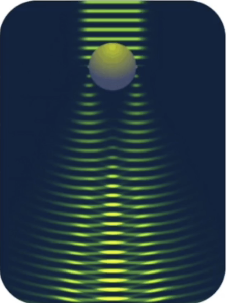
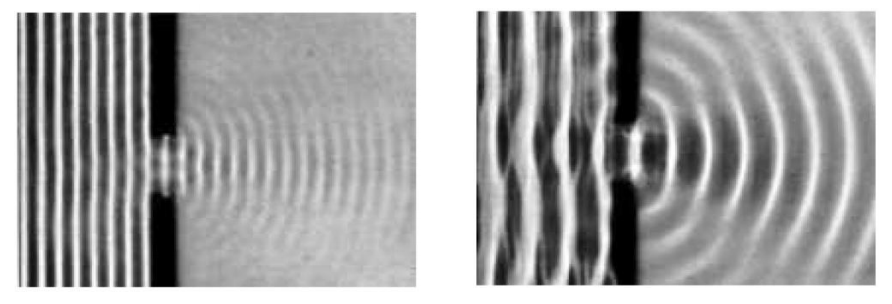
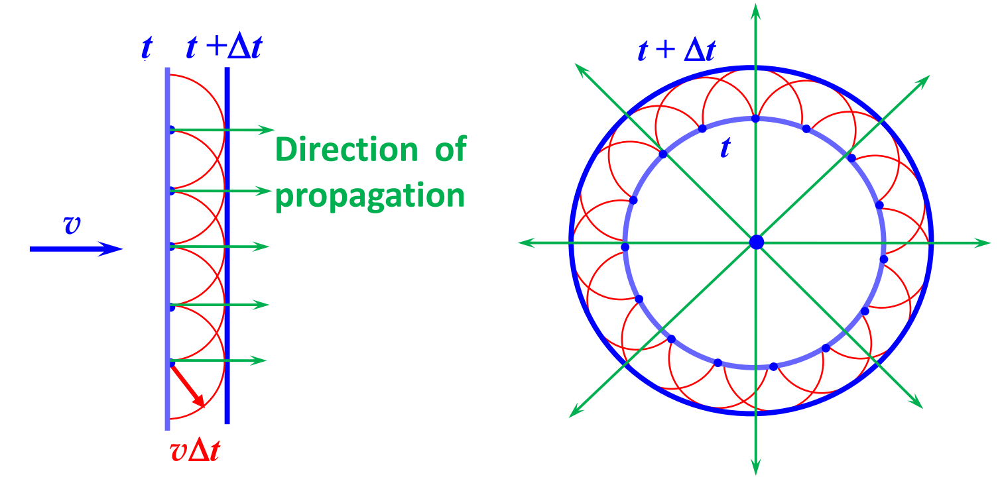
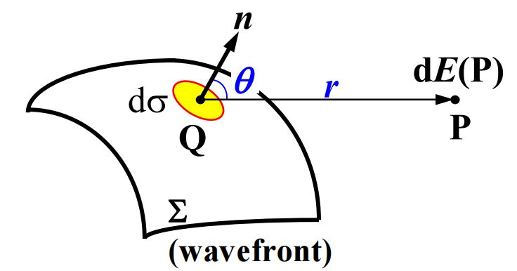
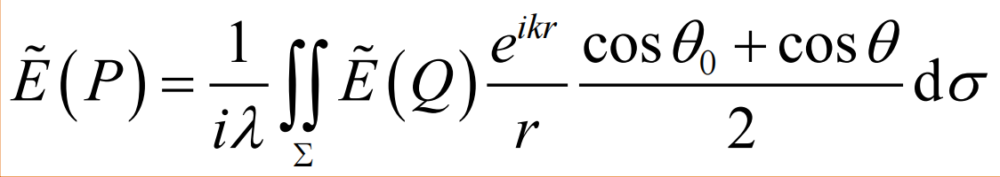

# 七：衍射

## 内容概述

- 衍射（Diffraction），光在传播途中偏移直线传播，强度重新分布的过程
- 惠更斯-菲涅尔原理
- 定量分析衍射
- 统一衍射和直线传播

## 衍射

衍射是光在传播途中偏移直线传播，强度重新分布的过程

> 物体遮挡光线，就会产生阴影
>
> 在几何光学中，光线只会被完全遮挡/完全不遮挡，因此阴影应该是清晰的
>
> 但现实中的阴影是软阴影，其实就是发生了衍射

一组平行的波阵面通过小孔，会变成圆形

波长越长，越容易观测到衍射

- 小孔尺寸在波长的1000倍左右时衍射现象不明显
- 小孔尺寸在波长的10倍左右时衍射十分明显
- 小孔尺寸和波场相近时会发生散射

### 衍射的分类

- 菲尼尔衍射：光源和接收屏距离有限
- 夫朗禾费衍射：光源和接收屏距离无限（也就是入射光是平行光）

夫朗禾费衍射需要用透镜将平行光汇聚

### 干涉与衍射的关系

相同：

- 干涉和衍射都是相干叠加

不同：

- 干涉是离散点光源叠加求和，衍射是连续次波源叠加积分
- 干涉满足几何光学规律，衍射不满足几何光学规律

## 惠更斯-菲涅尔原理

### 惠更斯

惠更斯：波阵面上每一个点，本质上是一个球面次级小波的发射源，下一个波阵面实际上是这些球面的包络线（envelope）

理论的作用

- 根据这个理论，给定一个波阵面，我们可以画出下一个波阵面
- 解释了光在各向同性介质中的传播原理
- 解释了反射和折射公式

局限性

- 无法区分光沿直线传播和发生衍射的条件
- 无法定量分析衍射强度
- 根据该理论，应该会有反转波

### 菲涅尔

菲涅尔修正了惠更斯的理论

- 波阵面上每一个（无阻塞）点都是球面波的发射源，频率与主波相同
- 不在波阵面上的点，都是由小波相干叠加得到的

**衍射是无数干涉的叠加**

#### 倾斜因子

惠更斯的理论会应该会存在向后的波，菲涅尔引入了倾斜因子（Tilt factor）
$$
F(\theta_0, \theta)=\frac{1}{2}(\cos\theta_0+\cos \theta)
$$

倾斜因子的引入使得向后的波强度为0，自然就不会出现反转波

不过倾斜因子的引入是纯经验，这也是菲涅尔理论的局限性

### 基尔霍夫积分定律

基尔霍夫在倾斜因子的基础上添加了一个常数K，提供了一个$-\pi/2$的相位差
$$
K=\frac{e^{-i\pi/2}}{\lambda}
$$
于是衍射积分公式转化为：

## 巴俾涅原理

## 傅立叶变换

## 正弦光栅衍射

## 单缝夫琅禾费衍射

## 小孔夫琅禾费衍射

## 多缝衍射

